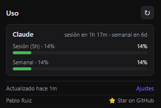
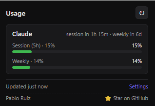
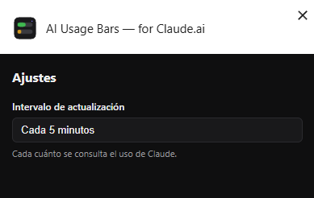
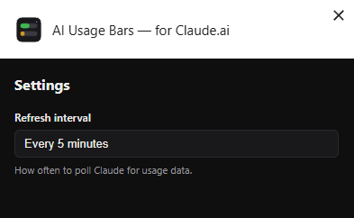

# AI Usage Bars — for Claude.ai

> Visualiza el consumo de tu cuenta de Claude.ai directamente en la barra de herramientas de Chrome: sesión (5h) y límite semanal, de un vistazo.

[](https://chromewebstore.google.com/detail/ai-usage-bars-%E2%80%94-for-claud/hjoibcighplbeihnhphjipfobpaihekd)
[](https://chromewebstore.google.com/detail/ai-usage-bars-%E2%80%94-for-claud/hjoibcighplbeihnhphjipfobpaihekd)
[](https://chromewebstore.google.com/detail/ai-usage-bars-%E2%80%94-for-claud/hjoibcighplbeihnhphjipfobpaihekd)
[](https://developer.chrome.com/docs/extensions/mv3/intro/)
[](LICENSE)
[]()

---

## ¿Qué es?

Una extensión ligera para Chrome que te muestra **en tiempo real** cuánto te queda del límite de **sesión de 5 horas** y del **límite semanal** de tu cuenta de Claude.ai, sin tener que entrar a `claude.ai/settings/usage` cada dos por tres.

El icono de la toolbar se dibuja dinámicamente con dos barras (sesión arriba, semanal abajo) que cambian de color según el nivel de uso:

- 🟢 **Verde** — por debajo del 60%
- 🟡 **Amarillo** — entre 60% y 85%
- 🔴 **Rojo** — más del 85%, conviene moderar el consumo

Al pulsar el icono se abre un popup con el detalle: porcentajes exactos, tiempo restante hasta el siguiente reset, y enlaces de soporte.

## Características

- 📊 **Dos barras en el icono** — sesión (5h) y semanal, siempre visibles sin abrir nada
- 🔄 **Actualización automática** — cada 1, 5 o 15 minutos (configurable)
- 🌍 **11 idiomas** con auto-detección del idioma del navegador
- 🔒 **100% local** — tus datos no salen del navegador, ni hay backend propio
- 🪶 **Ligero** — ~25 KB empaquetado, sin frameworks ni dependencias en tiempo de ejecución
- 🌓 **Modo oscuro nativo** en el popup
- ♿ **Accesible** — aria-labels y soporte de teclado

## Capturas

La extensión se adapta automáticamente al idioma del navegador. Aquí dos de los 11 idiomas soportados:

|  | Español | English |
| :--- | :---: | :---: |
| **Popup** |  |  |
| **Ajustes** |  |  |

## Instalación

### Desde Chrome Web Store (recomendado)

👉 **[Instalar AI Usage Bars desde la Chrome Web Store](https://chromewebstore.google.com/detail/ai-usage-bars-%E2%80%94-for-claud/hjoibcighplbeihnhphjipfobpaihekd)**

Un solo clic y listo. Las actualizaciones llegan automáticamente.

### Manualmente (modo desarrollador)

Si quieres probarla antes de que esté en la Store:

1. Descarga la última release desde [Releases](https://github.com/brassoy/ai-usage-bars/releases) o clona este repo y compila tú mismo (ver más abajo).
2. Descomprime el zip en cualquier carpeta.
3. Abre Chrome en `chrome://extensions`.
4. Activa el **modo desarrollador** (esquina superior derecha).
5. Pulsa **"Cargar descomprimida"** y selecciona la carpeta con el `manifest.json`.

Listo. Verás el icono en la toolbar. La primera vez tarda unos segundos en cargar los datos.

## ¿Cómo funciona?

La extensión usa los mismos endpoints internos que la página `claude.ai/settings/usage` consume:

1. Descubre tu organización activa mediante `GET /api/organizations` (autenticado con tu cookie de sesión).
2. Cachea el UUID en `chrome.storage.local`.
3. Consulta `GET /api/organizations/{orgId}/usage` periódicamente y guarda el snapshot.
4. Renderiza el icono con `OffscreenCanvas` en el service worker → dos barras → `chrome.action.setIcon`.
5. Si recibe `401`, marca el estado como "no has iniciado sesión" y muestra un enlace para acceder.

Todo ocurre dentro del navegador. No hay servidores intermediarios, ni telemetría, ni analítica.

## Privacidad y seguridad

Probablemente la parte más importante:

- ✅ **Sin backend propio.** La extensión no se comunica con ningún servidor que no sea `claude.ai`.
- ✅ **Sin recolección de datos.** Ni email, ni IP, ni patrones de uso, nada.
- ✅ **Sin tokens almacenados.** La autenticación se delega a la cookie de sesión que ya tiene tu navegador para `claude.ai`. La extensión nunca lee ni almacena la cookie.
- ✅ **Sin permisos sensibles.** Solo `storage` (para el caché) y `alarms` (para refrescar). El permiso a `claude.ai/*` es necesario para que las peticiones vayan con tu cookie de sesión automáticamente.
- ✅ **Código abierto.** Puedes auditar cada línea en este mismo repo.

Para que la extensión funcione tienes que estar **iniciado sesión en `claude.ai`** en el mismo navegador. Si cierras la sesión, el icono pasa a estado "no autenticado" hasta que vuelvas a entrar.

## Idiomas soportados

La extensión detecta automáticamente el idioma de tu navegador y elige el correspondiente:

| Código | Idioma | Código | Idioma |
| :----: | :----- | :----: | :----- |
| `en` | English | `it` | Italiano |
| `es` | Español | `ru` | Русский |
| `pt_BR` | Português (Brasil) | `ja` | 日本語 |
| `fr` | Français | `zh_CN` | 简体中文 |
| `de` | Deutsch | `hi` | हिन्दी |
| `ar` | العربية (RTL) | | |

Si tu idioma no está en la lista, la extensión usará inglés por defecto. ¿Quieres ver tu idioma soportado? Manda un PR con un nuevo archivo en `public/_locales/<código>/messages.json`.

## Compilar desde el código fuente

Para desarrolladores: clonado, build, debug y release.

📖 **Guía completa**: [`BUILDING.md`](BUILDING.md) — comandos, estructura, troubleshooting, cómo añadir idiomas, cómo lanzar versiones.

Quickstart:

```bash
git clone https://github.com/brassoy/ai-usage-bars.git
cd ai-usage-bars
npm install
npm run build   # output en dist/, cárgala descomprimida en chrome://extensions
```

## Estructura del proyecto

```
ai-usage-bars/
├── popup.html                  # Punto de entrada del popup
├── options.html                # Página de ajustes
├── vite.config.ts              # Build + generación del manifest.json
├── public/
│   ├── _locales/               # Traducciones (11 idiomas)
│   └── icons/                  # PNGs estáticos generados
├── scripts/
│   ├── generate-icons.ts       # Genera iconos PNG con pngjs
│   └── package.ts              # Empaqueta dist/ en un zip
└── src/
    ├── background/             # Service worker (alarms, fetch, icon)
    ├── popup/                  # Lógica del popup
    ├── options/                # Lógica de ajustes
    ├── providers/              # Adapter pattern (claude.ts)
    ├── storage/                # Wrappers de chrome.storage
    ├── icon/                   # Renderizado del icono (canvas)
    └── i18n.ts                 # Helpers de chrome.i18n
```

## Tecnologías

- [TypeScript](https://www.typescriptlang.org/) — tipado estricto
- [Vite](https://vitejs.dev/) — build moderno, multi-entry
- [Manifest V3](https://developer.chrome.com/docs/extensions/mv3/intro/) — el estándar actual de Chrome
- [`chrome.i18n`](https://developer.chrome.com/docs/extensions/reference/api/i18n) — internacionalización nativa
- [`OffscreenCanvas`](https://developer.mozilla.org/docs/Web/API/OffscreenCanvas) — renderizado del icono en el service worker
- Sin frameworks runtime (sin React, sin Vue, sin Tailwind). HTML + CSS + TS plano.

## Roadmap

Ideas para futuras versiones (sin compromiso de cuándo):

- [ ] Histórico de uso (gráfica de los últimos 7 días)
- [ ] Notificación cuando el uso supere un umbral configurable
- [ ] Soporte para múltiples organizaciones de Claude (selector en ajustes)
- [ ] Tema claro / sincronizado con el del sistema
- [ ] Soporte para Firefox (requiere portar el manifest a v2 o esperar MV3 estable en Firefox)
- [ ] Selector manual de idioma en ajustes (override del auto-detect)

¿Echas en falta algo? [Abre un issue](https://github.com/brassoy/ai-usage-bars/issues).

## Contribuir

Las contribuciones son bienvenidas, sobre todo:

- 🌐 **Traducciones nuevas** o correcciones a las existentes (copia `public/_locales/en/messages.json` a la carpeta de tu idioma y traduce).
- 🐛 **Bugs** — abre un issue con pasos para reproducir.
- ✨ **Funcionalidades** — para cambios grandes, abre antes un issue de discusión.

Antes de mandar un PR, asegúrate de que `npm run typecheck` y `npm run build` pasan sin errores.

## Aviso legal

Esta es una **extensión no oficial**, sin afiliación, patrocinio ni respaldo de Anthropic. Únicamente lee los datos de uso de **tu propia cuenta** mediante la sesión que ya tienes en `claude.ai`.

Los endpoints utilizados son los mismos que consume la web oficial y pueden cambiar sin previo aviso. Si dejan de funcionar, abre un issue.

Claude es una marca registrada de [Anthropic, PBC](https://www.anthropic.com/).

## Licencia

[MIT](LICENSE) © 2026 Pablo Ruiz

## Autor

**Pablo Ruiz**
[LinkedIn](https://www.linkedin.com/in/pabloruizsanmiguel/) · [GitHub](https://github.com/brassoy)

Si te resulta útil, dale a ⭐ al repo. Ayuda a que más gente lo encuentre.
